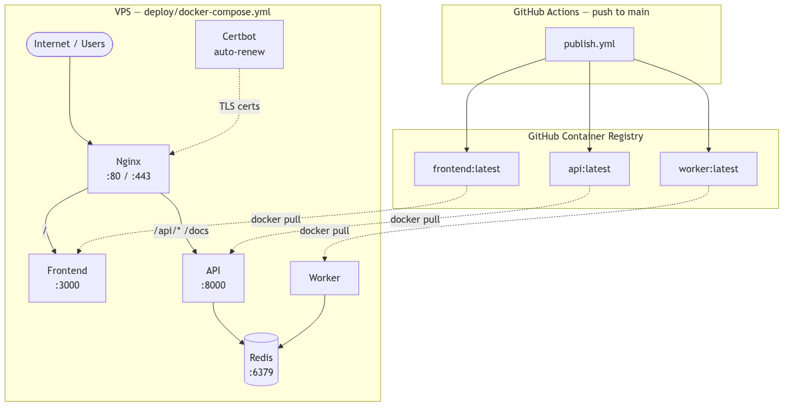
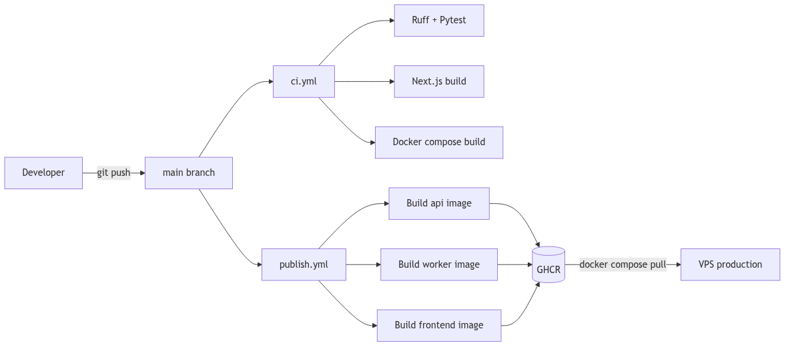
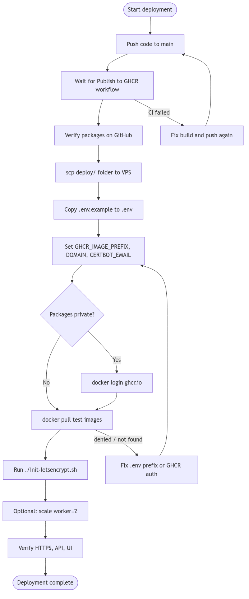
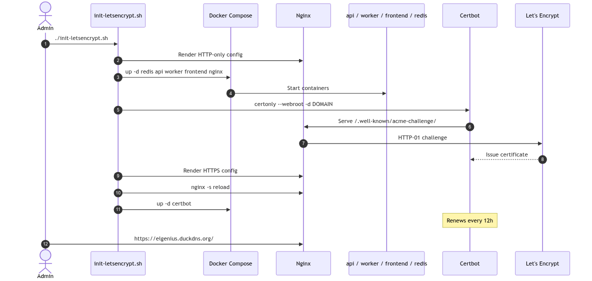

# Deployment Guide

Complete guide for deploying the Dilamme Job Scheduler to a VPS with Docker, GHCR, Nginx, and Let's Encrypt HTTPS.

## Architecture



*Source: [`diagrams/deployment-architecture.mmd`](diagrams/deployment-architecture.mmd)*

| Environment | Compose file | Images |
|-------------|--------------|--------|
| Local dev | `docker-compose.yml` (repo root) | Built from source |
| Production VPS | `deploy/docker-compose.yml` | Pulled from GHCR |

The VPS does **not** need the full repository — only the `deploy/` folder.

---

## Prerequisites

### On your machine

- GitHub repository with CI enabled
- Push access to `main` (triggers image publish)

### On the VPS

- Ubuntu (or similar Linux) with public IP
- Docker Engine + Docker Compose v2
- Ports **80** and **443** open in the cloud security group / firewall
- SSH key access

### Domain

- A domain or dynamic DNS hostname pointing to the VPS public IP
- Example: [DuckDNS](https://www.duckdns.org/), No-IP, or any DNS provider

### GHCR images

- Images must be published by CI before first deploy
- Push to `main` runs `.github/workflows/publish.yml`

Published images:

```
ghcr.io/<github-owner>/<repo-name>/api:latest
ghcr.io/<github-owner>/<repo-name>/worker:latest
ghcr.io/<github-owner>/<repo-name>/frontend:latest
```

**Important:** `GHCR_IMAGE_PREFIX` must match your GitHub repo name exactly (lowercase).

| GitHub repo | Correct prefix |
|-------------|----------------|
| `Goldeno10/dilamme-job-scheduler` | `ghcr.io/goldeno10/dilamme-job-scheduler` |
| `Goldeno10/hng14-stage9-job-scheduler` | `ghcr.io/goldeno10/hng14-stage9-job-scheduler` |

---

## Part 1 — CI/CD (GitHub → GHCR)



*Source: [`diagrams/cicd-pipeline.mmd`](diagrams/cicd-pipeline.mmd)*

### How it works

1. Push code to `main`
2. GitHub Actions runs tests (`.github/workflows/ci.yml`)
3. Publish workflow builds and pushes Docker images (`.github/workflows/publish.yml`)

### Verify images were published

1. Open your repo on GitHub
2. Check **Actions** — "Publish to GHCR" should be green
3. Check **Packages** (right sidebar) — `api`, `worker`, `frontend` should exist

### GHCR access (private packages)

By default, GHCR packages are **private**. The VPS must authenticate before pulling.

**Option A — Make packages public (easiest)**

GitHub → Your profile → **Packages** → select package → **Package settings** → **Change visibility** → **Public**

**Option B — Use a Personal Access Token**

1. GitHub → Settings → Developer settings → Personal access tokens
2. Create a token with `read:packages` scope
3. On the VPS:

```bash
echo YOUR_GITHUB_PAT | docker login ghcr.io -u YOUR_GITHUB_USERNAME --password-stdin
```

---

## Deployment workflow overview



*Source: [`diagrams/deploy-workflow.mmd`](diagrams/deploy-workflow.mmd)*

---

## Part 2 — VPS Setup

### Install Docker

SSH into the VPS:

```bash
ssh -i /path/to/your-key.pem ubuntu@YOUR_VPS_IP
```

Install Docker:

```bash
sudo apt update
sudo apt install -y docker.io docker-compose-plugin
sudo usermod -aG docker $USER
```

Log out and back in so the `docker` group applies.

Verify:

```bash
docker --version
docker compose version
```

### Point domain to VPS

1. Get your VPS public IP: `curl -4 ifconfig.me`
2. In DuckDNS (or your DNS provider), create/update a record pointing to that IP
3. Wait a few minutes, then verify: `ping your-domain.duckdns.org`

---

## Part 3 — Copy deploy folder to VPS

From your **local machine** (not the VPS):

### Create target directory

`/opt` requires sudo on first use:

```bash
ssh -i /path/to/your-key.pem ubuntu@YOUR_VPS_IP \
  "sudo mkdir -p /opt/job-scheduler && sudo chown ubuntu:ubuntu /opt/job-scheduler"
```

### Copy files

```bash
scp -i /path/to/your-key.pem -r deploy/. ubuntu@YOUR_VPS_IP:/opt/job-scheduler/
```

> Use `deploy/.` (with trailing `/.`) to copy **contents** into `/opt/job-scheduler/`.

**Alternative** — deploy to home directory (no sudo):

```bash
scp -i /path/to/your-key.pem -r deploy/ ubuntu@YOUR_VPS_IP:~/job-scheduler
```

### What gets copied

```
/opt/job-scheduler/
├── docker-compose.yml
├── .env.example
├── init-letsencrypt.sh
├── README.md
└── nginx/
    ├── nginx.conf
    └── conf.d/
        ├── app.conf.template
        └── app-http-only.conf.template
```

---

## Part 4 — Configure environment

SSH into the VPS:

```bash
ssh -i /path/to/your-key.pem ubuntu@YOUR_VPS_IP
cd /opt/job-scheduler
cp .env.example .env
nano .env
```

### Required variables

```env
# Must match GitHub repo: ghcr.io/<owner>/<repo-name>
GHCR_IMAGE_PREFIX=ghcr.io/goldeno10/dilamme-job-scheduler
IMAGE_TAG=latest

# Your public domain
DOMAIN=elgenius.duckdns.org
CERTBOT_EMAIL=you@example.com
```

### Optional variables

```env
SCHEDULER_ALGORITHM=heap
DLQ_ALERT_THRESHOLD=5
DLQ_ALERT_EMAIL=ops@dilamme.com
HTTP_PORT=80
HTTPS_PORT=443

# Use while testing certs (avoids Let's Encrypt rate limits)
# CERTBOT_STAGING=1
```

---

## Part 5 — Test image pull (recommended)

Before running the full init script, confirm GHCR access:

```bash
docker pull ghcr.io/goldeno10/dilamme-job-scheduler/api:latest
docker pull ghcr.io/goldeno10/dilamme-job-scheduler/worker:latest
docker pull ghcr.io/goldeno10/dilamme-job-scheduler/frontend:latest
```

If you see `denied` or `not found`:

| Error | Fix |
|-------|-----|
| `denied` | Run `docker login ghcr.io` or make packages public |
| `not found` | Wrong `GHCR_IMAGE_PREFIX` — check repo name on GitHub |
| CI failed | Fix Docker build in Actions, push again |

---

## Part 6 — First deploy (HTTPS bootstrap)



*Source: [`diagrams/letsencrypt-bootstrap.mmd`](diagrams/letsencrypt-bootstrap.mmd)*

```bash
cd /opt/job-scheduler
chmod +x init-letsencrypt.sh
./init-letsencrypt.sh
```

### What the script does

1. **Renders HTTP-only nginx config** — serves ACME challenge on port 80
2. **Starts core services** — redis, api, worker, frontend, nginx
3. **Requests Let's Encrypt certificate** — certbot webroot challenge
4. **Switches to HTTPS nginx config** — TLS on port 443
5. **Reloads nginx**
6. **Starts certbot renewal container** — auto-renews every 12 hours

### Scale workers (optional)

```bash
docker compose up -d --scale worker=2
```

### Check running containers

```bash
docker ps
```

Expected services: `redis`, `api`, `worker`, `frontend`, `nginx`, `certbot`

---

## Part 7 — Verify deployment

Replace `YOUR_DOMAIN` with your actual domain.

| Check | URL |
|-------|-----|
| UI | `https://YOUR_DOMAIN/` |
| API stats | `https://YOUR_DOMAIN/api/v1/stats` |
| Swagger docs | `https://YOUR_DOMAIN/docs` |
| Health | `https://YOUR_DOMAIN/health` |
| SSE stream | `curl -N https://YOUR_DOMAIN/api/v1/events` |

### Create a test job

```bash
curl -X POST https://YOUR_DOMAIN/api/v1/jobs \
  -H "Content-Type: application/json" \
  -d '{
    "type": "send_email",
    "priority": 1,
    "payload": {
      "to": "test@gmail.com",
      "subject": "Welcome"
    }
  }'
```

### View logs

```bash
docker compose logs -f api
docker compose logs -f worker
docker compose logs -f nginx
```

---

## Part 8 — Deploying updates

When you push new code to `main`, CI rebuilds and pushes images. On the VPS:

```bash
cd /opt/job-scheduler
docker compose pull
docker compose up -d
```

To pin a specific version:

```env
IMAGE_TAG=b8133af   # commit SHA from CI
```

Then `docker compose pull && docker compose up -d`.

---

## Troubleshooting

### `scp: stat remote: No such file or directory`

The target directory does not exist. Create it first:

```bash
ssh -i your-key.pem ubuntu@YOUR_VPS_IP \
  "sudo mkdir -p /opt/job-scheduler && sudo chown ubuntu:ubuntu /opt/job-scheduler"
```

### `error from registry: denied`

GHCR packages are private and the VPS is not logged in.

```bash
echo YOUR_PAT | docker login ghcr.io -u YOUR_USERNAME --password-stdin
```

Or make packages public in GitHub Package settings.

### `not found` when pulling images

Wrong `GHCR_IMAGE_PREFIX` in `.env`. It must match the GitHub **repository name**, not your local folder name.

```bash
grep GHCR_IMAGE_PREFIX .env
# Should be: ghcr.io/goldeno10/dilamme-job-scheduler
```

### Certbot / HTTPS fails

- Confirm domain DNS points to VPS IP
- Confirm ports 80 and 443 are open in AWS/security group
- Use staging first: `CERTBOT_STAGING=1` in `.env`
- Check nginx logs: `docker compose logs nginx`

### API returns 500 on job create with scheduled time

Ensure you have deployed the latest API image (timezone fix). Pull and restart:

```bash
docker compose pull api worker
docker compose up -d
```

### SSE errors in API logs (`Timeout reading from redis`)

Fixed in newer API images — pull latest `api` image. The dashboard still works; SSE reconnects automatically.

### `../containerd/: Permission denied`

Normal — ignore this. Use `docker ps` and `docker compose logs` instead.

---

## HNG Stage 9 submission checklist

| Requirement | How to satisfy |
|-------------|----------------|
| GitHub repo | Push full project to GitHub |
| Live UI URL | `https://YOUR_DOMAIN/` |
| API docs | `https://YOUR_DOMAIN/docs` (Swagger) |
| Architecture doc | `docs/architecture.md` |
| Deployed server | This VPS deployment |
| Public domain | DuckDNS or similar |
| HTTPS | Let's Encrypt via `init-letsencrypt.sh` |
| Nginx reverse proxy | Dockerized nginx in `deploy/` |
| Manual deploy (no Render/Railway) | VPS + docker compose |

---

## Quick reference

```bash
# Local dev
docker compose up --build

# VPS — first time
scp -r deploy/. ubuntu@VPS:/opt/job-scheduler/
ssh ubuntu@VPS
cd /opt/job-scheduler && cp .env.example .env && nano .env
./init-letsencrypt.sh

# VPS — update
docker compose pull && docker compose up -d

# VPS — logs
docker compose logs -f api worker
```

---

## Diagram sources

Mermaid sources and PNG exports live in [`docs/diagrams/`](diagrams/). To regenerate PNGs after editing `.mmd` files:

```bash
cd docs/diagrams
./render.sh
```
