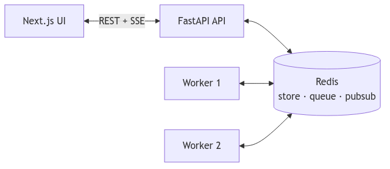

# Architecture Document — Background Job Scheduler

**Project:** Dilamme Job Scheduler (HNG Stage 9)  
**Version:** 0.1.0  
**Last updated:** 2026-06-11

---

## 1. Executive Summary

This system is a distributed background job scheduler. Clients submit work through a REST API; jobs are persisted and queued in Redis, processed by independent worker processes, and observed through a web dashboard with Server-Sent Events (SSE).

Design goals:

- Decouple job submission from execution (API never blocks on handler completion)
- Guarantee ordered execution by priority, schedule time, and creation time
- Support failure handling (retries, dead-letter queue), dependency graphs, and recurring work
- Provide two interchangeable scheduling algorithms: heap (default) and timing wheel

---

## 2. System Context



*Diagram source: [`diagrams/system-architecture.mmd`](diagrams/system-architecture.mmd)*

| Actor | Interaction |
|-------|-------------|
| Client (browser / API consumer) | Creates and monitors jobs via HTTPS |
| FastAPI application | Accepts requests, enqueues jobs, streams events |
| Worker process(es) | Poll scheduler, execute handlers, update state |
| Redis | Job store, queues, locks, pub/sub |
| Nginx (production) | TLS termination, reverse proxy to API and frontend |

Production topology is documented in [`DEPLOYMENT.md`](DEPLOYMENT.md).

---

## 3. Component Architecture

### 3.1 API Layer (`backend/app/`)

| Module | Responsibility |
|--------|----------------|
| `main.py` | Application bootstrap, CORS, lifespan |
| `api/routes.py` | REST endpoints, SSE stream, workflow creation |
| `api/benchmark.py` | Scheduler performance comparison |
| `services/job_service.py` | Job lifecycle orchestration |
| `services/job_store.py` | Redis persistence and DAG index |
| `services/events.py` | Pub/sub → SSE bridge |
| `handlers/` | Job type handlers (`send_email`, `webhook`, …) |

Public interfaces:

- REST API under `/api/v1`
- OpenAPI documentation at `/docs`
- SSE at `/api/v1/events`

### 3.2 Worker Layer (`backend/app/worker/main.py`)

Workers run as separate OS processes (or containers). Each worker:

1. Polls the active scheduler for the next eligible job
2. Acquires a distributed lock on the job ID
3. Invokes the registered handler
4. Updates job state, unlocks DAG dependents, schedules recurring follow-ups

Workers do not share memory with the API. Horizontal scaling is achieved by running multiple worker replicas.

### 3.3 Frontend (`frontend/`)

Next.js application providing:

- Dashboard (job counts by status)
- Jobs table with filtering and cancellation
- Job creation form (including DAG workflow trigger)
- Dead-letter queue view with manual retry

Live updates use the browser `EventSource` API against `/api/v1/events`.

### 3.4 Scheduler Abstraction

Both schedulers implement `BaseScheduler` (`backend/app/scheduler/base.py`):

| Method | Purpose |
|--------|---------|
| `enqueue(job)` | Add job to queue or scheduled set |
| `dequeue()` | Return highest-priority ready job |
| `remove(job_id)` | Remove job from all queue structures |
| `promote_due_scheduled()` | Move time-elapsed scheduled jobs to active queue |
| `size()` | Approximate queue depth |

Active implementation is selected at runtime via `SCHEDULER_ALGORITHM` (`heap` | `timing_wheel`) in `scheduler/factory.py`.

---

## 4. Data Model

### 4.1 Job Entity

| Field | Type | Description |
|-------|------|-------------|
| `id` | UUID string | Primary identifier |
| `type` | string | Handler key (e.g. `send_email`) |
| `payload` | object | Handler-specific input |
| `priority` | 1 \| 2 \| 3 | 1 = high, 3 = low |
| `status` | enum | `pending`, `processing`, `completed`, `failed`, `cancelled` |
| `retry_count` | int | Failed attempts so far |
| `scheduled_at` | datetime (optional) | Do not run before this instant |
| `interval` | enum (optional) | Recurring: `every_1_minute`, `every_5_minutes`, `every_1_hour` |
| `depends_on` | string[] | Parent job IDs (DAG) |
| `in_dlq` | bool | Present in dead-letter queue |
| `error` | string (optional) | Last failure message |

### 4.2 Redis Keyspace

| Key pattern | Structure | Purpose |
|-------------|-----------|---------|
| `job:{id}` | String (JSON) | Canonical job document |
| `jobs:index` | Set | All job IDs |
| `queue:heap` | Sorted set | Active heap queue (member = job ID) |
| `queue:scheduled` | Sorted set | Future-scheduled jobs (score = timestamp) |
| `wheel:slot:{N}` | Sorted set | Timing wheel bucket (per slot) |
| `wheel:scheduled` | Sorted set | Wheel scheduled-job index |
| `dlq:index` | Set | Jobs in dead-letter queue |
| `lock:job:{id}` | String | Worker lock (NX, TTL 30s) |
| `job:dependents:{id}` | Set | Child jobs waiting on parent `id` |
| `job:events` | Pub/sub channel | Real-time event broadcast |

---

## 5. Job Lifecycle

```
                    ┌─────────────┐
                    │   pending   │
                    └──────┬──────┘
                           │ worker dequeues
                           ▼
                    ┌─────────────┐
         ┌─────────│ processing  │─────────┐
         │         └─────────────┘         │
         │ success                       │ unrecoverable failure
         ▼                                 ▼
  ┌─────────────┐                   ┌─────────────┐
  │  completed  │                   │   failed    │──► DLQ (after max retries)
  └─────────────┘                   └─────────────┘

  pending / processing ──cancel──► cancelled
```

### 5.1 State Transitions

| From | To | Trigger |
|------|-----|---------|
| — | `pending` | `POST /api/v1/jobs` |
| `pending` | `processing` | Worker dequeues and acquires lock |
| `processing` | `completed` | Handler returns successfully |
| `processing` | `failed` | Handler throws; retries exhausted |
| `processing` | `cancelled` | Cancel received; result discarded after handler returns |
| `pending` | `cancelled` | `DELETE /api/v1/jobs/{id}` |
| `failed` (DLQ) | `pending` | `POST /api/v1/dlq/{id}/retry` |

### 5.2 Cancellation Semantics

If a job is cancelled while a worker is processing it, the handler may still complete. Before committing the result, the worker re-reads job status from Redis. If status is `cancelled`, the result is discarded and no state transition to `completed` occurs.

---

## 6. Scheduling

### 6.1 Heap Scheduler (Default)

**Implementation:** `backend/app/scheduler/heap_scheduler.py`

Redis sorted set `queue:heap` acts as a distributed min-heap. The member with the **lowest score** is the next job to run (`ZPOPMIN`).

**Score function** (`BaseScheduler.compute_score`):

```
score = effective_priority × 10¹⁵ + scheduled_ts × 10³ + created_ts
```

Ordering guarantees:

1. Effective priority (lower numeric value = higher priority)
2. Scheduled timestamp
3. Creation timestamp

Future jobs (`scheduled_at > now`) are stored in `queue:scheduled` until `promote_due_scheduled()` moves them into the heap.

**Complexity:** O(log n) enqueue and dequeue per operation.

### 6.2 Starvation Prevention (Priority Aging)

**Implementation:** `Job.effective_priority()` in `backend/app/models/job.py`

| Parameter | Value | Config key |
|-----------|-------|------------|
| Aging interval | 60 seconds | `AGING_INTERVAL_SECONDS` |
| Boost per interval | 1 priority level | `AGING_BOOST_LEVELS` |

A job waiting longer than the interval has its effective priority increased (numeric value decreased), capped at priority 1 (high). Aged jobs receive lower heap scores and are dequeued sooner.

### 6.3 Timing Wheel (Alternative)

**Implementation:** `backend/app/scheduler/timing_wheel.py`

A circular buffer of 3,600 slots indexed by `unix_timestamp % slots`. Each slot is a Redis sorted set ordered by the same composite score used by the heap.

| Path | Behaviour |
|------|-----------|
| Immediate job | Inserted into current slot |
| Future `scheduled_at` | Indexed in `wheel:scheduled` and placed in target slot |
| Dequeue | `ZPOPMIN` on current slot; scans up to 10 prior slots if empty |

**Complexity:** O(1) insert into bucket; dequeue may require scanning adjacent slots.

**Activation:** `SCHEDULER_ALGORITHM=timing_wheel` on API and worker containers.

### 6.4 Scheduler Benchmark

**Implementation:** `backend/app/api/benchmark.py`  
**Endpoint:** `GET /api/v1/benchmark/run?n_jobs=1000`

#### Methodology

1. Execute `FLUSHDB` on the connected Redis database
2. Create *n* jobs with rotating priorities (1, 2, 3); every 5th job receives `scheduled_at` between 0–9 seconds in the future
3. Persist all jobs, then measure total enqueue duration
4. Dequeue until all jobs are removed; measure total dequeue duration
5. Repeat for heap and timing wheel on separate flushed databases

#### Test Environment

| Parameter | Value |
|-----------|-------|
| Date | 2026-06-11 |
| Job count | 1,000 |
| Redis | `redis:7-alpine` (local) |
| Runtime | Python 3.13, uv |
| Wheel slots | 3,600 |

#### Measured Results

| Scheduler | Enqueue (total) | Enqueue (µs/job) | Dequeue (total) | Dequeue (µs/job) |
|-----------|-----------------|------------------|-----------------|------------------|
| Heap | 2,057.07 ms | 2,057 | 2,824.39 ms | 2,824 |
| Timing wheel | 1,580.03 ms | 1,580 | 4,582.93 ms | 4,583 |

Observed delta on this workload: timing wheel enqueue −23%; heap dequeue −38%.

#### Comparative Analysis

| Criterion | Heap | Timing wheel |
|-----------|------|--------------|
| Enqueue complexity | O(log n) | O(1) per bucket |
| Dequeue complexity | O(log n), single global min | O(1) per pop; multi-slot scan possible |
| Global priority ordering | Strict | Approximate (per-slot) |
| Scheduled job handling | Secondary sorted set | Native time buckets |
| Operational complexity | Lower | Higher (many slot keys) |
| Default in production | Yes | No (opt-in) |

**Design decision:** Heap remains the production default because dequeue latency and global priority ordering are dominant requirements for this scheduler. The timing wheel is retained as a configurable alternative for workloads dominated by delayed and recurring jobs.

#### Reproduction

```bash
cd backend && uv sync
REDIS_URL=redis://localhost:6379/0 uv run python -m app.api.benchmark
```

> **Note:** The benchmark endpoint executes `FLUSHDB`. Do not run against production Redis with live job data.

---

## 7. Failure Handling

### 7.1 Retries

| Attempt | Backoff (base × jitter) |
|---------|-------------------------|
| 1 | ~1 s |
| 2 | ~5 s |
| 3 | ~25 s |

Formula: `retry_backoff_base × 5^(attempt-1) × uniform(0.5, 1.5)`. Maximum attempts: 3 (`MAX_RETRIES`).

Failed retries re-enqueue the job with an updated `scheduled_at`.

### 7.2 Dead-Letter Queue (DLQ)

After exhausting retries, the job is marked `failed`, `in_dlq: true`, and indexed in `dlq:index`. Engineers may inspect error details and trigger `POST /api/v1/dlq/{id}/retry`, which resets retry count and re-enqueues the job.

### 7.3 DLQ Alerting

| Parameter | Value |
|-----------|-------|
| Threshold | 5 jobs in DLQ |
| Action | Structured log (`dlq_threshold_alert`) + SSE `dlq_alert` event |
| Notification target | `ops@dilamme.com` (simulated) |

---

## 8. DAG Workflows

Jobs may declare `depends_on: [parent_job_id, …]`. A dependent job is not enqueued until every parent has `status: completed`.

**Dependency index:** `job:dependents:{parent_id}` → set of child job IDs.

**Built-in pipeline** (`POST /api/v1/workflows/report-pipeline`):

```
generate_report → upload_file → send_email
```

On parent completion, `_unlock_dependents()` evaluates each child; if all dependencies are satisfied, the child is enqueued.

If a parent lands in the DLQ, dependents remain blocked indefinitely until the parent is manually retried and completes.

---

## 9. Concurrency and Idempotency

### 9.1 Duplicate Protection

Before processing, a worker executes `SET lock:job:{id} NX EX 30`. If the lock is not acquired, the job is re-enqueued. The lock is released after processing completes.

This prevents two workers from executing the same job concurrently, including under multi-worker deployment.

### 9.2 Recurring Jobs

On successful completion, if `interval` is set, a new job document is created with `scheduled_at = now + interval` and enqueued. Each recurrence is a distinct job record.

---

## 10. Observability

### 10.1 Structured Logging

All significant events are emitted as JSON via `structlog`:

`job_created`, `job_started`, `job_completed`, `job_failed`, `job_cancelled`, `retry_attempted`, `job_enqueued_heap`, `job_scheduled`, `dlq_threshold_alert`

### 10.2 Real-Time Events (SSE)

Job state changes are published to Redis channel `job:events`. The API exposes them at `GET /api/v1/events` using `sse-starlette`. A dedicated Redis client with `socket_timeout=None` supports long-lived pub/sub connections.

---

## 11. Technology Stack

| Layer | Technology |
|-------|------------|
| API | FastAPI, Pydantic v2, uvicorn |
| Queue / store | Redis 7 |
| Workers | Python asyncio, independent process |
| Frontend | Next.js 15, React 19 |
| Package management | uv (Python), npm (Node) |
| Container registry | GHCR |
| Reverse proxy / TLS | Nginx, Certbot (production) |

---

## 12. Deployment Overview

| Environment | Compose file | Image source |
|-------------|--------------|--------------|
| Local development | `docker-compose.yml` (repo root) | Built from source |
| Production VPS | `deploy/docker-compose.yml` | Pulled from GHCR |

See [`DEPLOYMENT.md`](DEPLOYMENT.md) for provisioning, HTTPS, and operational procedures.

---

## 13. Related Artifacts

| Artifact | Location |
|----------|----------|
| API collection | [`postman_collection.json`](postman_collection.json) |
| Deployment guide | [`DEPLOYMENT.md`](DEPLOYMENT.md) |
| Architecture diagrams | [`diagrams/`](diagrams/) |
| Redis reset script | [`deploy/reset-redis.sh`](../deploy/reset-redis.sh) |
